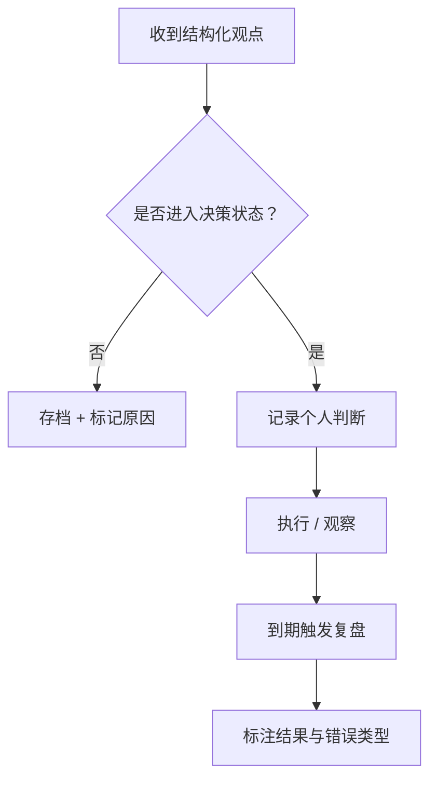
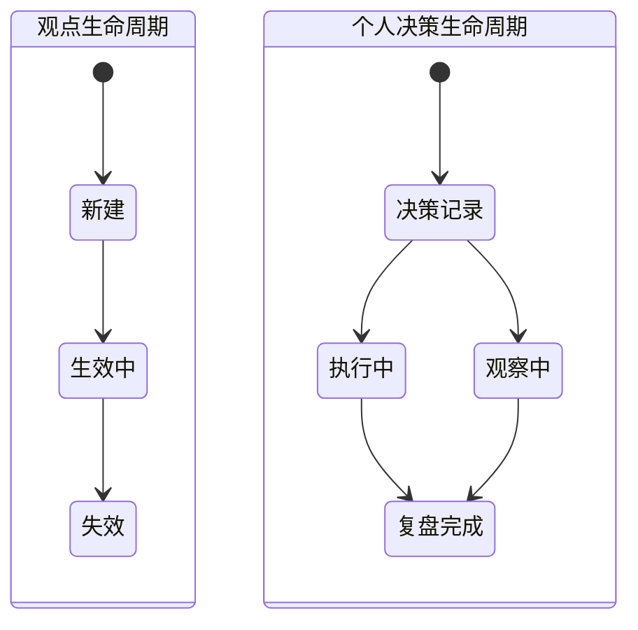
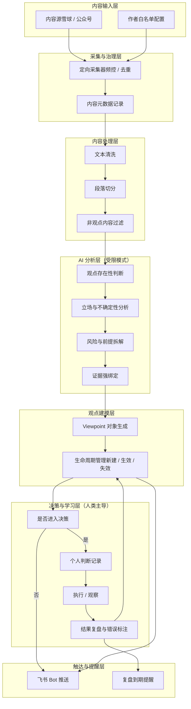

# 投研分析产品PRD（决策闭环）

# 1. 文档信息

- 产品名称：投资观点分析与推送系统
- 文档类型：产品需求文档（PRD）
- 当前版本：V1.1（工程化 MVP）
- 目标阶段：个人/小团队使用
- 核心目标：验证“观点建模 + 回溯价值”

---

# 2. 背景与问题定义

## 2.1 背景

当前投资者面临的核心问题不是“信息不足”，而是：

- 信息来源分散、质量参差
- 大量投资内容以情绪表达或事后解释为主
- 投资观点缺乏结构化表达，无法回溯验证，难以形成长期认知资产

用户需要的并非更多内容，而是**可被验证、可被复盘的观点型信息**。

## 2.2 核心问题定义

本产品聚焦解决三个关键问题：

1. 如何从非结构化内容中，提取**可被验证的投资观点**？
2. 如何在引入 AI 的前提下，**最大程度约束幻觉与臆断**？
3. 如何将「观点 → 决策 → 结果 → 复盘」形成**可积累的个人认知闭环**？

---

# 3. 产品目标与成功标准

## 3.1 产品目标

- 将非结构化投资内容转化为“结构化投资观点”
- 为用户提供低频、高密度的投资认知输入
- 建立可回溯、可复盘的个人决策记录系统

## 3.2 成功标准（MVP）

| 维度 | 验收标准 |
| --- | --- |
| 推送频率 | 单日推送 ≤ 3 条观点 |
| 观点结构 | 每条观点必须包含：立场、依据、风险、时间维度 |
| 可解释性 | 每个判断必须绑定原文证据 |
| 回溯能力 | 支持 30 / 60 / 90 天后自动触发复盘 |
| 决策区分 | 明确区分「观点输入」与「个人决策」 |

# 4. 用户与使用场景

## 4.1 目标用户

- 当前版本仅供 **创作者本人** 使用
- 用户同时扮演：分析者 / 决策者 / 复盘者

## **4.2 用户在系统中的位置**

系统定位说明：

- 系统 **不做决策**
- 系统只提供可验证的「输入信号」
- 学习价值来源于用户的**显式判断与复盘**

---

# 5. 产品范围与非目标

## 5.1 产品范围**（工程化 MVP）**

- 白名单作者内容采集
- 观点结构化抽取与建模
- 低频观点推送（飞书 Bot 等）
- 个人决策记录与结果回溯

## 5.2 非目标（明确不做）

- 自动交易或操作建议
- 高频行情与量化分析
- 覆盖所有投资内容源
- 保证 AI 判断正确性

**说明**：MVP 阶段仅保证「过程可回溯、判断可解释」，不承诺判断准确率。

---

# 6. 功能需求**（工程级定义）**

## 6.1 内容源管理

- 支持配置白名单作者
- 支持多内容源抽象接口（雪球、微信公众号等）
- 可手动启停单一内容源

**可测试标准**：

- 关闭内容源后，不再产生新内容
- 已采集内容不受影响

## 6.2 内容采集

- 定向抓取指定作者内容
- 支持采集频率控制（如 1h / 6h）
- 支持内容去重

**系统记录字段**：

- 内容 ID
- 作者
- 原始链接
- 采集时间

## 6.3 内容处理

- 文本清洗（广告、免责声明等）
- 段落切分
- 非观点内容过滤（情绪、闲聊、复盘叙事）

**非观点判定规则（至少满足其一）**：

- 未提及具体资产对象
- 未指向未来时间
- 不包含可验证条件

## 6.4 AI 分析（受限模式）

### 6.4.1 模块约束原则

- AI 不输出「是否操作」建议
- AI 仅输出结构化中间判断
- 所有判断必须绑定原文证据

### 6.4.2 观点抽取

输出字段：

- 是否存在观点：是 / 否 / 模糊
- 证据段落引用

> 当置信度 < 设定阈值时，统一标记为「模糊观点」，不进入推送队列。
> 

### 6.4.3 立场与不确定性标注

- 立场类型：多 / 空 / 中性 / 无法判断
- 不确定性来源说明（信息缺失 / 前提不明）

### 6.4.4 风险与假设拆解

- 显性风险列表
- 隐含前提假设列表

## 6.5 观点建模**（Viewpoint）**

**设计原则**：

- 观点仅作为外部输入信号
- 不直接参与结论或评分

**核心字段（MVP）**：

- Viewpoint ID
- 关联内容 ID
- 资产对象
- 立场
- 风险
- 时间维度

## 6.6 **个人决策记录模块**

### **6.6.1** 决策闭环流程图

### 6.6.2 最小决策记录模型（MDRM）

进入决策时，必须填写：

- 是否采纳观点：是 / 否
- 个人判断摘要（必填）
- 预期验证时间（必填）

## 6.7 决策结果回溯

- 到期自动提醒复盘
- 标注结果：符合预期 / 偏差 / 完全错误
- 错误类型示例：
    - 前提错误
    - 时间判断错误
    - 风险低估

## 6.8 通知与交互

- 飞书 Bot 仅作为触发器
- 核心操作必须回到决策记录界面完成

---

# 7. 数据与模型设计（概要）

## 7.1 核心实体

- 内容（Content）
- 观点（Viewpoint）
- 作者（Author）
- 资产（Asset）
- Decision（个人决策）
- Review（复盘）

## 7.2 观点与决策生命周期（双轨）

### 生命周期状态图

说明：

- 观点本身不判对错
- **只有进入个人决策生命周期，系统才具备“学习价值”**

---

# 8. 合规与风险控制

- 明确标注“非投资建议”
- 内容仅作观点引用与分析
- 支持内容源快速替换
- 不对观点正确性作承诺

---

# 9. 技术架构（逻辑层）

## 9.1 系统总体架构图

该架构强调：

- **观点只是输入信号**
- **个人决策是系统运转的核心节点**

---

# 10. 里程碑规划

- 第 1 阶段：单一内容源 + 本地观点库
- 第 2 阶段：观点回溯与验证
- 第 3 阶段：个人偏好与错误画像

---

# 11. 未解决问题（待验证）

优先级比较低，后续再迭代处理：

- 观点价值评分的客观性
- 不同作者观点冲突的处理方式
- 用户对低频推送的接受度